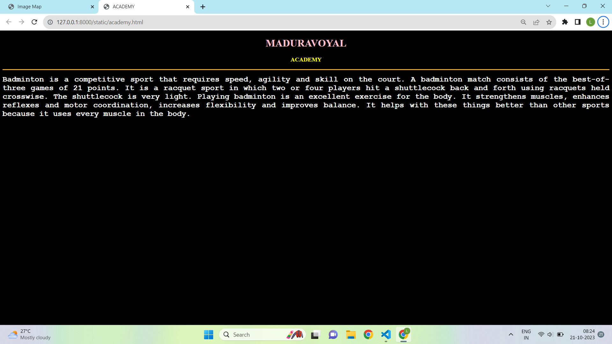
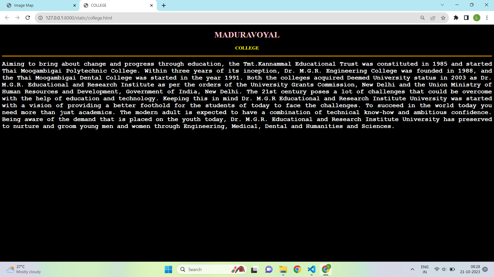
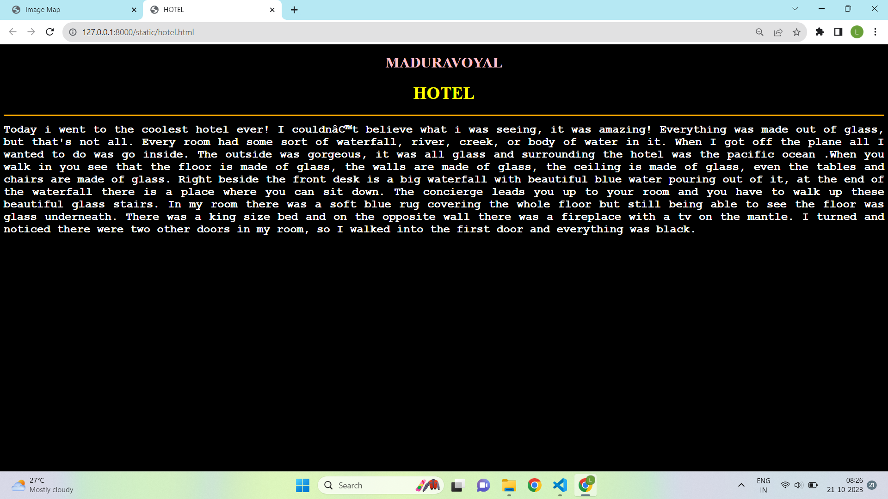
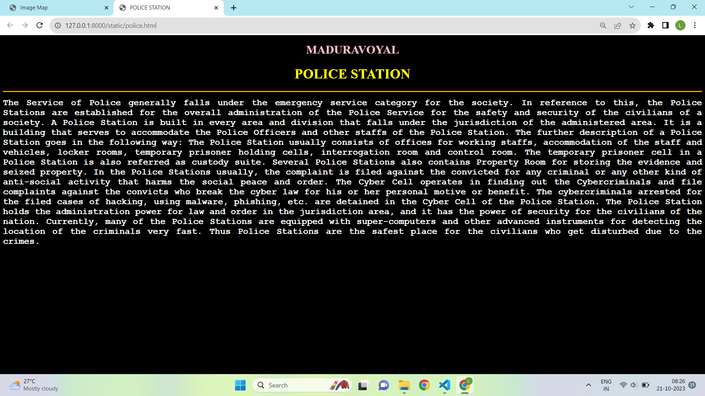

# Ex04 Places Around Me
## AIM
To develop a website to display details about the places around my house.

## DESIGN STEPS

### STEP 1
Create a Django admin interface.

### STEP 2
Download your city map from Google.

### STEP 3
Using ```<map>``` tag name the map.

### STEP 4
Create clickable regions in the image using ```<area>``` tag.

### STEP 5
Write HTML programs for all the regions identified.

### STEP 6
Execute the programs and publish them.

## CODE
```
<!DOCTYPE html>
<html>
    <head>
        <title>
            Image Map
        </title>
    </head>
    <body bgcolor ="black">
        <h1 align="center" >
            <font color="white" >
                    Image Map Of My Home
            </font>
        </h1>
        <h3 align="center">
        <font color=" blue" face ="cursive">
            LINGARAJA L (2122221000086)
        </font>
            
        </h3>
        <center>
           <!-- Image Map Generated by http://www.image-map.net/ -->


<map name="image-map">
    <area target="_blank" alt="academy" title="academy" href="academy.html" coords="180,17,347,141" shape="rect">
    <area target="_blank" alt="police" title="police" href="police.html" coords="859,664,1042,768" shape="rect">
    <area target="_blank" alt="hotel" title="hotel" href="hotel.html" coords="1085,706,1227,794" shape="rect">
    <area target="_blank" alt="college" title="college" href="college.html" coords="1077,215,1294,338" shape="rect">
    <area target="_blank" alt="home" title="home" href="home.html" coords="1356,406,1472,483" shape="rect">
</map>


        </center>
        <p align="center">
            <font color="purple"  face="Comic Sans MS" >
                This Image Map shows various locations around my home.<br>
                Click the location and get information about it.
            </font>
        </p>


    </body>
</html>


<!DOCTYPE html>
<html>
    <head>
        <title>
            HOME
        </title>

    </head>
    <body bgcolor ="black">
        <h1 align="center">
            <font color = "pink">
                <b>
                    MADHURAVOYAL
                </b>
            </font>
            <h1>
            <h3 align="center">
            <font color = "yellow">
                <b>
                   HOME
                </b>
            </font>
            
        </h3>
<hr size="3" color="orange">
<p align="justify">
    <font face="Courier New" size="5">
        <b>
            <font color = "white">
                My home is situated in the city. It is not too big nor too small, just the perfect size. My family lives in the home. It comprises of my father, mother, sister and grandparents. We live in our ancestral home so my home is very vintage.

                It is very old but remains to be super strong. There are six rooms in my home. Each family member has a unique room which they have decorated as per their liking. For instance, my elder sister is a big fan of music, so her walls are filled with posters of musicians like BTS, RM, and more.
                
                Our drawing room is a large one with a high ceiling. We still use the vintage sofa set which my grandmother got as a wedding gift. Similarly, there is a vintage TV and radio which she uses till date.
                
                Adjoining the drawing room is my bedroom. It is my favourite room because it contains everything that I love. I have a pet guinea pig which lives in a cage in my room. We also have a storeroom which is filled with things we don’t use but also cannot discard.        </b>
        </b>
    </font>
</p>
    </body>
</html>

<!DOCTYPE html>
<html>
    <head>
        <title>
            ACADEMY
        </title>

    </head>
    <body bgcolor ="black">
        <h1 align="center">
            <font color = "pink">
                <b>
                    MADURAVOYAL
                </b>
            </font>
            <h1>
            <h3 align="center">
            <font color = "yellow">
                <b>
                   ACADEMY
                </b>
            </font>
            
        </h3>
<hr size="3" color="orange">
<p align="justify">
    <font face="Courier New" size="5">
        <b>
            <font color = "white">
                Badminton is a competitive sport that requires speed, agility and skill on the court. A badminton match consists of the best-of-three games of 21 points. It is a racquet sport in which two or four players hit a shuttlecock back and forth using racquets held crosswise. The shuttlecock is very light.

                Playing badminton is an excellent exercise for the body. It strengthens muscles, enhances reflexes and motor coordination, increases flexibility and improves balance. It helps with these things better than other sports because it uses every muscle in the body.        </b>
    </font>
</p>
    </body>
</html>

<!DOCTYPE html>
<html>
    <head>
        <title>
            COLLEGE
        </title>

    </head>
    <body bgcolor ="black">
        <h1 align="center">
            <font color = "pink">
                <b>
                    MADURAVOYAL
                </b>
            </font>
            <h1>
            <h3 align="center">
            <font color = "yellow">
                <b>
                   COLLEGE
                </b>
            </font>
            
        </h3>
<hr size="3" color="orange">
<p align="justify">
    <font face="Courier New" size="5">
        <b>
            <font color = "white">
                Aiming to bring about change and progress through education, the Tmt.Kannammal Educational Trust was constituted in 1985 and started Thai Moogambigai Polytechnic College. Within three years of its inception, Dr. M.G.R. Engineering College was founded in 1988, and the Thai Moogambigai Dental College was started in the year 1991. Both the colleges acquired Deemed University status in 2003 as Dr. M.G.R. Educational and Research Institute as per the orders of the University Grants Commission, New Delhi and the Union Ministry of Human Resources and Development, Government of India, New Delhi.

                The 21st century poses a lot of challenges that could be overcome with the help of education and technology. Keeping this in mind Dr. M.G.R Educational and Research Institute University was started with a vision of providing a better foothold for the students of today to face the challenges. To succeed in the world today you need more than just academics. The modern adult is expected to have a combination of technical know-how and ambitious confidence. Being aware of the demand that is placed on the youth today, Dr. M.G.R. Educational and Research Institute University has preserved to nurture and groom young men and women through Engineering, Medical, Dental and Humanities and Sciences.</b>
    </font>
</p>
    </body>
</html>

<!DOCTYPE html>
<html>
    <head>
        <title>
            HOTEL
        </title>

    </head>
    <body bgcolor ="black">
        <h1 align="center">
            <font color = "pink">
                <b>
                    MADURAVOYAL
                </b>
            </font>
            <h1>
            <h3 align="center">
            <font color = "yellow">
                <h1>
                   HOTEL
                </h1>
            </font>
            
        </h3>
<hr size="3" color="orange">
<p align="justify">
    <font face="Courier New" size="5">
        <b>
        <font color="white">
            Today i went to the coolest hotel ever! I couldn’t believe what i was seeing, it was amazing! Everything was made out of glass, but that's not all. Every room had some sort of waterfall, river, creek, or body of water in it. When I got off the plane all I wanted to do was go inside. The outside was gorgeous, it was all glass and surrounding the hotel was the pacific ocean .When you walk in you see that the floor is made of glass, the walls are made of glass, the ceiling is made of glass, even the tables and chairs are made of glass. Right beside the front desk is a big waterfall with beautiful blue water pouring out of it, at the end of the waterfall there is a place where you can sit down. The concierge leads you up to your room and you have to walk up these beautiful glass stairs. In my room there was a soft blue rug covering the whole floor but still being able to see the floor was glass underneath. There was a king size bed and on the opposite wall there was a fireplace with a tv on the mantle. I turned and noticed there were two other doors in my room, so I walked into the first door and everything was black. </b>
    </font>
</p>
    </body>
</html>


<!DOCTYPE html>
<html>
    <head>
        <title>
            POLICE STATION
        </title>

    </head>
    <body bgcolor ="black">
        <h1 align="center">
            <font color = "pink">
                <b>
                    MADURAVOYAL
                </b>
            </font>
            <h1>
            <h3 align="center">
            <font color = "yellow">
                <h1>
                   POLICE STATION
                </h1>
            </font>
            
        </h3>
<hr size="3" color="orange">
<p align="justify">
    <font face="Courier New" size="5">
        <b>
        <font color="white">
            The Service of Police generally falls under the emergency service category for the society. In reference to this, the Police Stations are established for the overall administration of the Police Service for the safety and security of the civilians of a society.

            A Police Station is built in every area and division that falls under the jurisdiction of the administered area. It is a building that serves to accommodate the Police Officers and other staffs of the Police Station. The further description of a Police Station goes in the following way:
            
            The Police Station usually consists of offices for working staffs, accommodation of the staff and vehicles, locker rooms, temporary prisoner holding cells, interrogation room and control room.
            The temporary prisoner cell in a Police Station is also referred as custody suite.
            Several Police Stations also contains Property Room for storing the evidence and seized property.
            In the Police Stations usually, the complaint is filed against the convicted for any criminal or any other kind of anti-social activity that harms the social peace and order.
            The Cyber Cell operates in finding out the Cybercriminals and file complaints against the convicts who break the cyber law for his or her personal motive or benefit.
            The cybercriminals arrested for the filed cases of hacking, using malware, phishing, etc. are detained in the Cyber Cell of the Police Station.
            The Police Station holds the administration power for law and order in the jurisdiction area, and it has the power of security for the civilians of the nation. Currently, many of the Police Stations are equipped with super-computers and other advanced instruments for detecting the location of the criminals very fast. Thus Police Stations are the safest place for the civilians who get disturbed due to the crimes.   
        </font>
</p>
    </body>
</html>
```


## OUTPUT





## HTML VALIDATOR


## RESULT
The program for implementing image maps using HTML is executed successfully.
